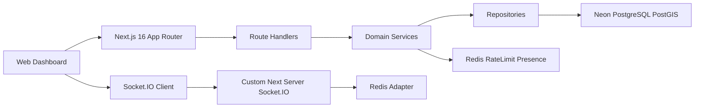
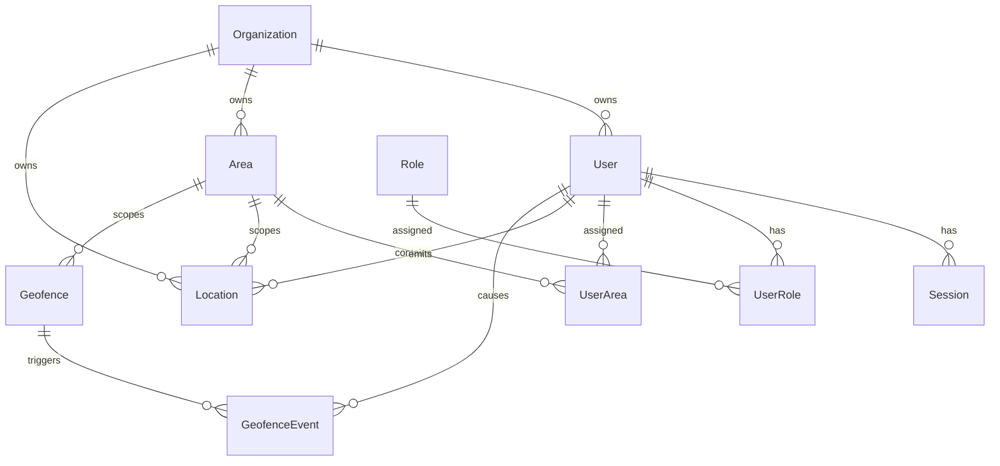
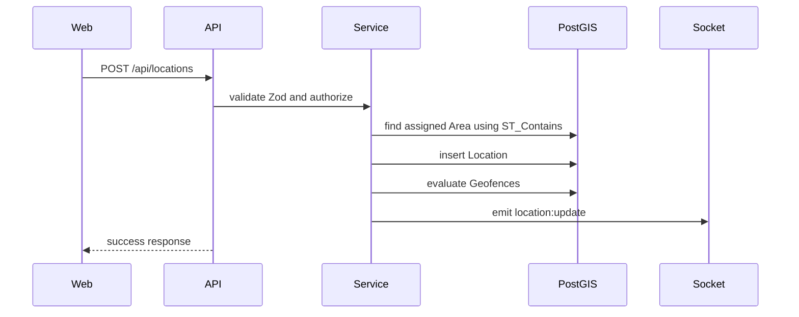
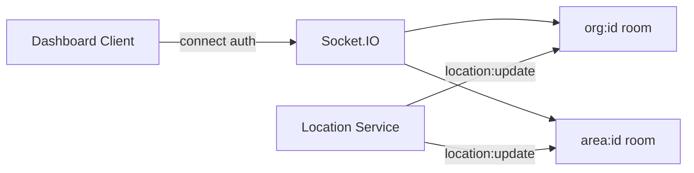

# Track TDR Architecture

## System

## Database

## Location Flow

## Socket.IO

## Production Strategy
- Use Neon pooled `DATABASE_URL` for application traffic and direct `DIRECT_DATABASE_URL` for migrations.
- Enable PostGIS on Neon before applying migrations.
- Run `npm run prisma:deploy` during release, then start the app.
- Use Redis for rate limiting, Socket.IO adapter and presence.
- Keep the Next.js custom server when Socket.IO is required in the same process.
- Partition `Location` by month when write volume grows beyond the initial single-table threshold.

## Observability
- Log API errors and domain events as structured JSON.
- Track metrics: positions/minute, Socket.IO connections, ingestion latency, DB query latency, Redis latency, geofence events/minute, out-of-area rate.
- Recommended stack: Sentry for errors, OpenTelemetry traces, Prometheus/Grafana for metrics.

## Microservices Evolution
1. Extract location ingestion into a dedicated service.
2. Add a queue/event bus for high-volume position writes.
3. Extract realtime gateway for Socket.IO.
4. Move geofence evaluation to async workers.
5. Archive old locations to cold storage while keeping aggregates in PostgreSQL.
